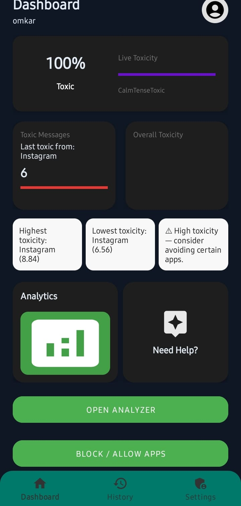
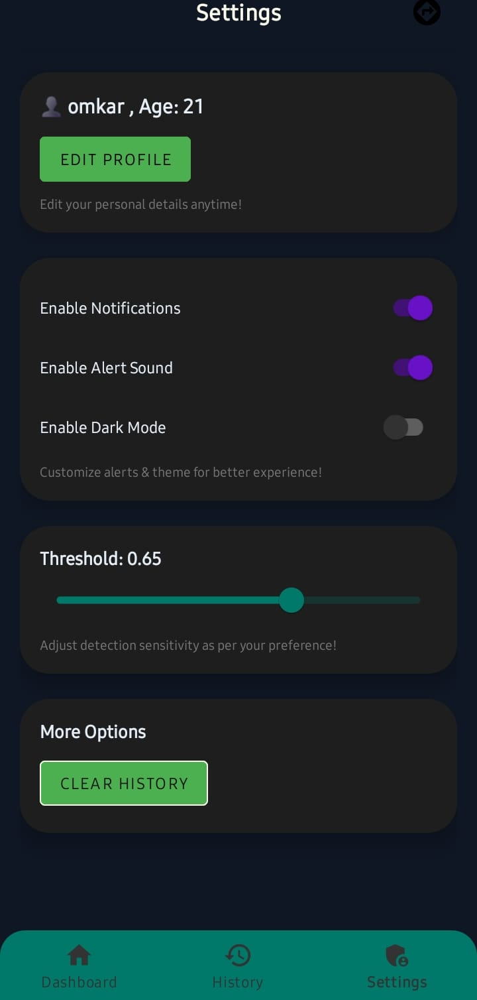
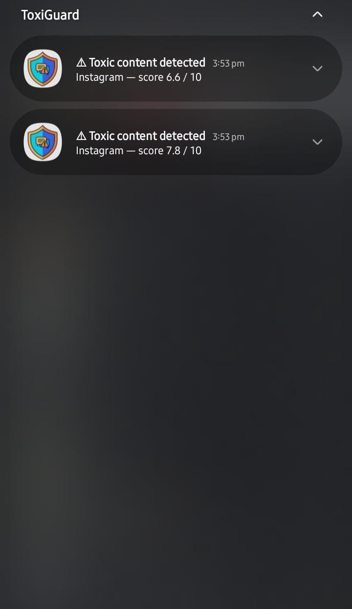
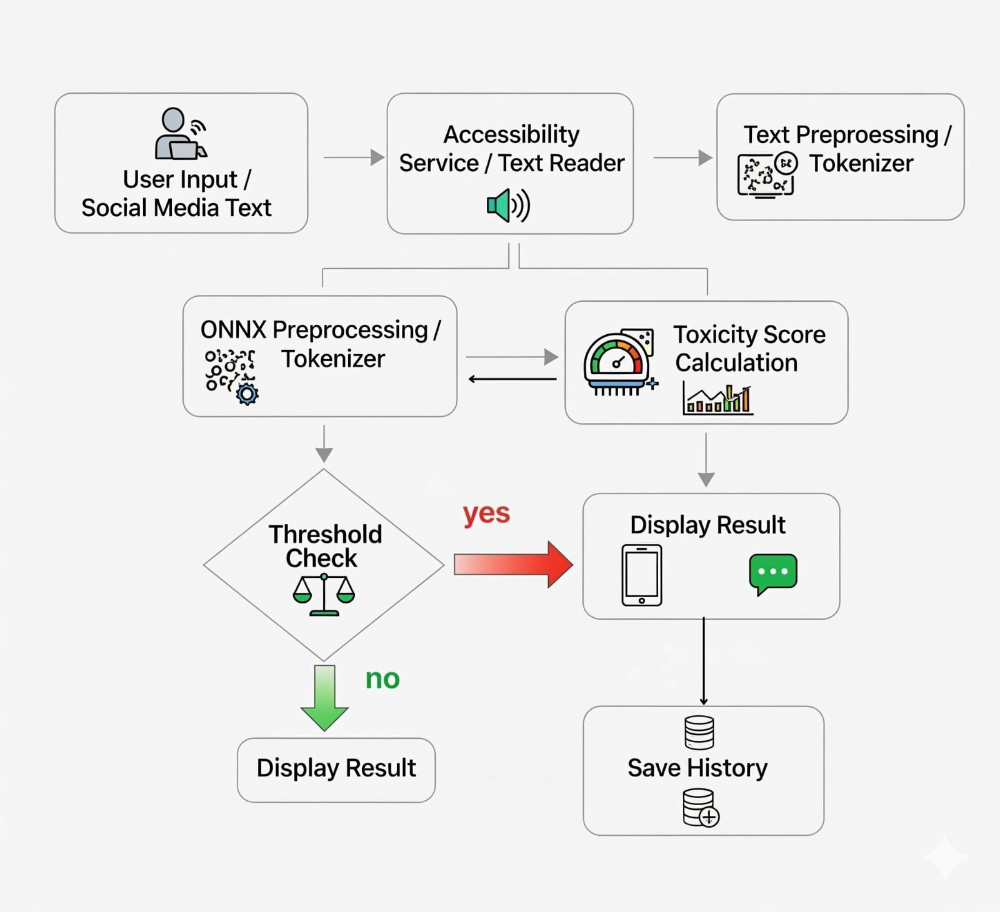

# 🛡️ ToxiGuard – AI Toxicity Detection Android App

   

ToxiGuard is a **production-focused AI-powered Android application** designed to detect toxic text in real time. The app performs **offline NLP inference** using a MiniLM ONNX model to analyze social media content and generate a toxicity score instantly — ensuring privacy, speed, and reliability without cloud dependency.

---

## 🚀 Key Features

* 🔍 Real-time toxicity detection from on-screen text
* 🤖 Offline AI inference using MiniLM ONNX model
* 📊 Toxicity score output (0–10 scale)
* 📱 Floating UI overlay for instant feedback
* 🔔 Smart notifications with toxicity results
* ⚡ Lightweight, fast, and privacy-first architecture

---

## 📸 Screenshots

Add real screenshots of the app UI to make the project more professional. Place your images inside a folder like `assets/screenshots/` and link them below.

### 🏠 Home Screen


### 🛡️ Settings


### 📊 Toxicity Result / Notification



---

## 🧠 Architecture Diagram


User Screen → Accessibility Service → Text Extraction → ONNX Runtime → MiniLM Model → Toxicity Score → Floating UI + Notifications


---

## 📥 Model Setup (model_q4f16.onnx)

This project uses a quantized MiniLM ONNX model for offline toxicity detection.

### Step 1 — Download the Model

Download the file:

```
model_q4f16.onnx
```

Place the model inside:

```
app/src/main/assets/
```

Final structure:

```
app/
 └── src/
     └── main/
         └── assets/
             └── model_q4f16.onnx
```

### Step 2 — Using the Model in the App

* The app loads the ONNX model from the `assets` folder.
* ONNX Runtime initializes the MiniLM model locally on device.
* Input text is tokenized and passed into the model.
* The output tensor is converted into a toxicity score (0–10).

### Step 3 — Important Notes

* Keep model size optimized (~20–30 MB recommended).
* Do NOT rename the file unless you update the loading path in code.
* Ensure ONNX Runtime dependency is added in Gradle.

---

## 🛠️ Tech Stack

**Android Development**

* Kotlin
* Android Studio
* Jetpack Navigation
* Material Design
* MVVM Architecture

**AI / Machine Learning**

* MiniLM NLP Model
* ONNX Runtime (Offline Inference)
* Text Toxicity Scoring

**Core Components**

* Accessibility Service
* Floating Overlay System
* Background Processing

---

## ⚙️ How It Works

1. The app reads visible text using Android Accessibility Service.
2. Extracted text is processed locally through ONNX Runtime.
3. MiniLM model predicts a toxicity score.
4. Results are displayed using floating overlay and notifications.

This architecture ensures **fast inference, offline privacy, and efficient mobile AI deployment**.

---

## 📂 Project Structure

* `app/` – Main Android application code
* `ui/` – Activities, Fragments, and UI components
* `model/` – ONNX model loading and inference logic
* `service/` – Accessibility service & background tasks
* `utils/` – Helper classes and utilities

---

## 🎯 Use Cases

* Detect toxic comments on social media platforms
* Promote safer online communication
* Demonstrate offline mobile AI deployment
* NLP experimentation on Android devices

---

## 📈 Future Improvements

* Multi-class toxicity detection
* Model quantization for faster inference
* Analytics dashboard for toxicity trends
* Multi-language NLP support

---

## 🤝 Contributing

Contributions and improvements are welcome. Fork the repo and create a pull request.

---

## 📄 License

This project is built for educational, research, and portfolio purposes.
